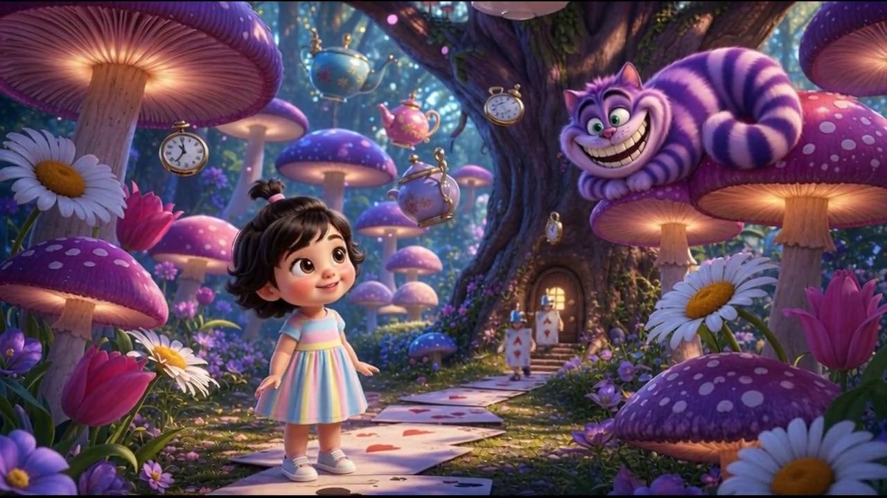
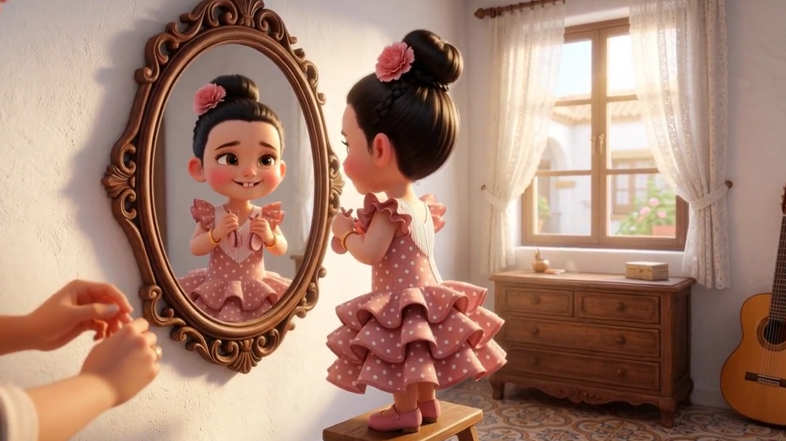

# Fábula

AI pipeline that turns a prompt into a Pixar-style animated short film with Spanish narration and music — powered by [FAL.ai](https://fal.ai) models.

```
                       ┌──────────────────┐
"una niña en la feria" →│ pixar-character  │ → character.png + anchor
                       └────────┬─────────┘
                                │
                       ┌────────▼─────────┐
                       │   pixar-story    │ → scene.md × 5
                       └────────┬─────────┘
                                │
                       ┌────────▼─────────┐      ┌──────────────┐
                       │  pixar-generate  │ ←─── │ pixar-review │ (optional stop)
                       └────────┬─────────┘      └──────────────┘
                                │
                    ┌───────────┼───────────┐
                    │           │           │
               scene images scene videos last frames
                    │           │           │
                    └───────────┼───────────┘
                                │
                       ┌────────▼─────────┐
                       │   pixar-merge    │ → final.mp4
                       └────────┬─────────┘
                                │
                    ┌───────────┼───────────┐
                    │           │           │
              pixar-audio   pixar-music     │
              (narration)  (Sonilo/YT)     │
                    │           │           │
                    └───────────┼───────────┘
                                │
                       ┌────────▼─────────┐
                       │    final mix     │ → final_with_music.mp4
                       └──────────────────┘
```

## Examples

[](https://github.com/manxeguin/fabula/blob/main/examples/carmen.mp4?raw=true)
[](https://github.com/manxeguin/fabula/blob/main/examples/claudia.mp4?raw=true)

| | Story | Preset | Duration |
|---|---|---|---|
| Carmen | La niña que leyó su propia historia | quality | 38s |
| Claudia | La Feria de Córdoba | testing | 25s |

*(Click thumbnails to download videos)*

## Quick Start

```bash
export FAL_API_KEY="your-fal-key"

# Create character from prompt or photo
/pixar-character "a little girl at the fair" --preset testing
# Or from a photo:
/pixar-character --photo ~/Downloads/photo.jpg

# Write the story
/pixar-story --story sevillana-feria

# Generate images + videos (optionally review first)
/pixar-generate --story sevillana-feria --review   # stops after images
/pixar-review sevillana-feria                       # inspect, approve, edit
/pixar-generate --story sevillana-feria --videos-only

# Add narration and music
/pixar-audio --story sevillana-feria --voice ara
/pixar-music --story sevillana-feria --voice ara
```

## Commands

| Command | What it does | Key flags |
|---|---|---|
| `/pixar-character` | Creates character design from prompt or photo | `--photo`, `--story`, `--preset` |
| `/pixar-story` | Writes 4-6 scene descriptions with visual + video prompts | `--story`, `--scenes N` |
| `/pixar-generate` | Creates scene images and animated videos | `--review`, `--videos-only`, `--images-only` |
| `/pixar-review` | Pause after images to inspect before spending on videos | `<story-slug>` |
| `/pixar-audio` | Spanish TTS narration per scene, concatenated | `--voice ara\|eve\|sal` |
| `/pixar-music` | Background music — AI-generated or YouTube | `--youtube`, `--prompt`, `--start` |
| `/pixar-merge` | Stitches all scene videos into final.mp4 | — |
| `/pixar-list` | Lists all stories with scene status | — |

## Agents

Each command is handled by an agent — the brains of the pipeline:

| Agent | Role |
|---|---|
| **pixar-orchestrator** | Central coordinator. Loads model configs, routes to subagents, handles retries and safety filters. |
| **pixar-character** | Character designer. Creates the CHARACTER ANCHOR (identity contract), generates character.png from text or photo using vision model auto-description. |
| **pixar-story-writer** | Story writer. Writes scene.md files with SCLCAM-structured visual prompts, comprehensive video prompts (7 elements), and flowing narrative-style Spanish narrations. |

## Presets

Switch cost/quality profiles via `PIPELINE_PRESET`:

| Preset | Character | Scenes | Video | Est. cost |
|---|---|---|---|---|
| `debug` (default) | FLUX.2 Klein 9B | FLUX.2 Klein Edit | Grok Imagine (3-10s) | ~$0.30 |
| `testing` | Nano Banana 2 | Nano Banana 2 Edit | Kling 2.5 Turbo (5s) | ~$2.23 |
| `budget` | Seedream V4 | Nano Banana 2 Edit | Kling O1 Std (5-10s) | ~$2.18 |
| `quality` | GPT Image 2 | GPT Image 2 Edit | Kling O1 Std (5-10s) | ~$4.50 |

Costs are for a 5-scene story (~30s). Prices from `genmedia pricing <endpoint>`. Debug preset uses `image_urls` for scene consistency (character reference per scene). Budget and quality presets support `start_image_url` for frame continuity via last-frame extraction.

## Key Features

- **Variable scene durations** — 3s to 15s depending on preset. Each scene gets its own duration in scene.md.
- **Frame continuity** — Extract last frame from each video, use as `start_image_url` for the next scene.
- **Photo-to-character** — Auto-describe photos via Nemotron vision model, generate Pixar character from the description.
- **Narrative narrations** — Single flowing story across all scenes, not mechanical per-scene descriptions. Transition words connect naturally.
- **CHARACTER ANCHOR** — Immutable identity block copied verbatim into every scene prompt. Prevents age/face/style drift.
- **Comprehensive video prompts** — 7-element structure (camera, setting, lighting, atmosphere, motion, mood, style) for richer animation.
- **Review checkpoint** — Stop after images with `/pixar-review`. Edit prompts, regenerate scenes, then proceed to videos.

## Spanish Narration Voices

| Voice | Style | Best for |
|---|---|---|
| `ara` | Warm, friendly | Emotional stories, gentle narration |
| `eve` | Energetic, upbeat | Exciting adventures, playful tales |
| `sal` | Smooth, balanced | Neutral narration, calm stories |

All female, Castilian Spanish (`es-ES`). Default: `ara`. Powered by xAI TTS v1.

## Directory Structure

```
stories/<preset>_<slug>/
├── character/
│   ├── character.md           ← CHARACTER ANCHOR + description
│   ├── character.png          ← reference image (1:1 square)
│   └── character_url.txt      ← CDN URL for scene generation
├── scenes/
│   ├── manifest.txt           ← scene order
│   ├── 01-<slug>/
│   │   ├── scene.md           ← Visual Prompt, Video Prompt, Narration
│   │   ├── scene.png          ← generated image (16:9)
│   │   ├── scene.mp4          ← animated video
│   │   └── scene_last_frame.png ← for continuity chaining
│   └── ...
├── narration_{voice}.mp3      ← concatenated narration
├── music.mp3                  ← background track
├── final.mp4                  ← merged video (no audio)
└── final_with_music_{voice}.mp4 ← final output
```

## Prerequisites

- **FAL_API_KEY** — [fal.ai/dashboard/keys](https://fal.ai/dashboard/keys) (inference key)
- **ffmpeg** + **ffprobe** — `brew install ffmpeg`
- **jq** — `brew install jq`
- **yt-dlp** — `brew install yt-dlp` (YouTube audio only)
- **python3** — for file uploads and JSON handling
- **genmedia** — `curl https://genmedia.sh/install | bash` (optional, for cost queries)

## API Reference

All models used, their quirks, and pricing. Configured in `pipeline_config.json`.

### Image Generation

| Model | Endpoint | Price | Notes |
|---|---|---|---|
| FLUX.2 Klein 9B | `fal-ai/flux-2/klein/9b` | $0.011/MP | Fast debug. Text-to-image only. |
| FLUX.2 Klein Edit | `fal-ai/flux-2/klein/9b/edit` | $0.011/MP | Requires `image_urls`. Used for scene consistency. |
| Nano Banana 2 | `fal-ai/nano-banana-2` | $0.08/img | `safety_tolerance: "6"` (string). Good stylization. |
| Nano Banana 2 Edit | `fal-ai/nano-banana-2/edit` | $0.08/img | Photo→Pixar transformation. More reliable than GPT Image 2 Edit. |
| GPT Image 2 | `openai/gpt-image-2` | ~$0.10/img | Premium. Five-section template recommended. |
| GPT Image 2 Edit | `openai/gpt-image-2/edit` | ~$0.10/img | Up to 16 reference images. Often times out with photos. |

### Video Generation

| Model | Endpoint | Price | Duration | Frame continuity | Key quirk |
|---|---|---|---|---|---|
| Grok Imagine | `xai/grok-imagine-video/image-to-video` | $0.05/s | 3-10s | No | Requires `prompt` + `image_url`. Sync. |
| Kling 2.5 Turbo | `fal-ai/kling-video/v2.5-turbo/pro/image-to-video` | $0.07/s | 5s | No | Requires `prompt`. Sync. |
| Kling O1 Std | `fal-ai/kling-video/o1/standard/image-to-video` | $0.084/s | 5s or 10s | `start_image_url` (style ref, not strict first frame) | Field is `start_image_url` not `image_url`. Sync. |
| Kling O1 Pro | `fal-ai/kling-video/o1/image-to-video` | $0.112/s | 5s or 10s | Same as Std | Higher quality. Sync. |
| Seedance 2.0 | `bytedance/seedance-2.0/image-to-video` | $0.30/s | 4-15s | `image_url` + optional `end_image_url` | Queue-based. Native audio. Expensive. |
| Vidu | `fal-ai/vidu/start-end-to-video` | $0.05/s | 4-10s | Both `start_image_url` + `end_image_url` required | True first→last frame. Sync. |
| Wan FLF2V | `fal-ai/wan-flf2v` | $0.40 flat | Fixed 5s | Both `start_image_url` + `end_image_url` required | Ignores duration param. |

### Audio

| Model | Endpoint | Price | Notes |
|---|---|---|---|
| xAI TTS v1 | `xai/tts/v1` | $0.00007/comp-s | Voices: ara, eve, sal. Field is `text` NOT `input`. |
| Sonilo v1.1 | `sonilo/v1.1/text-to-music` | $0.0025/s | `duration` param. Prompt-based instrumental. |
| ElevenLabs Music | `fal-ai/elevenlabs/music` | $0.80/min | `force_instrumental`. Higher quality. |

### Utility

| Model | Endpoint | Price | Notes |
|---|---|---|---|
| Nemotron Vision | `nvidia/nemotron-3-nano-omni/vision` | $0.006/1K tokens | Auto-describes photos for character generation. |

## License

MIT
